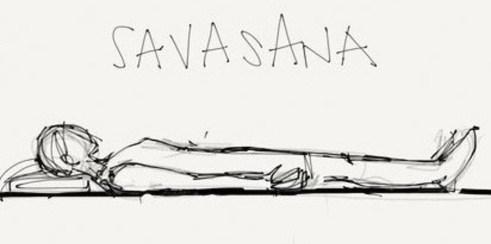
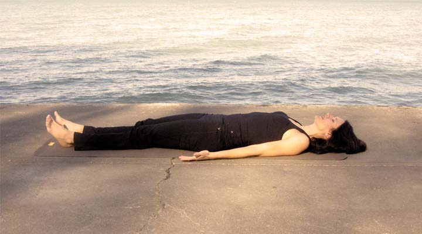

## Introduction
Life has become very complex in these days. The struggle for existence is very acute and keen. There is very keen competition in every walk of life. The bread problem has become very difficult to be solved. There is unemployment everywhere. Even brilliant young men with extraordinary qualification and recommendations hardly get job in these days. Therefore, a great deal of continuous mental and physical strain is imposed on modern humanity by its deadening daily work and unhealthy mode of life.

If you practise relaxation, no energy will be wasted. You will be very active, and energetic. During relaxation the muscles and nerves are at rest. The Prana or energy is stored up and conserved. The vast majority of persons who have no comprehensive understanding of this beautiful science of relaxation simply waste their energy by creating unnecessary movements of muscles and by putting the muscles and nerves under great strain.

## Benefits
The pleasant and exhilarating feeling can only be realised by those who can successfully do this Asana. Words cannot adequately describe the feelings. Every one of you should enjoy it. If you are tired from a hard work, perform this Asana for 5 minutes. You will be fit again to continue your hard work with the same vigour. This is a blessing for all hard workers.

## References
http://www.dlshq.org/messages/relaxation.htm