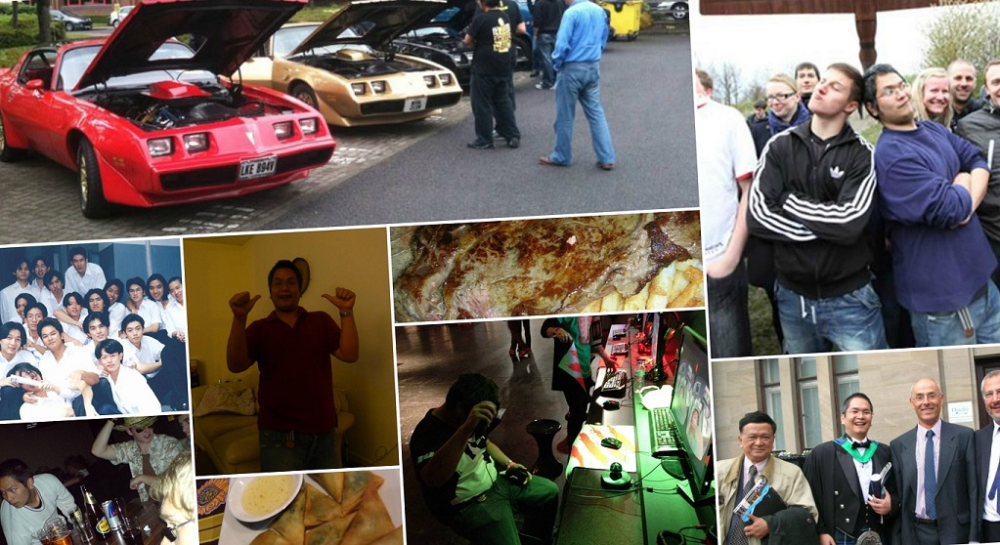
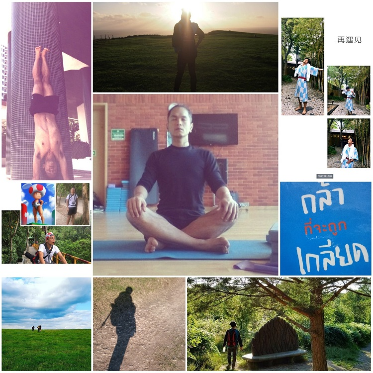
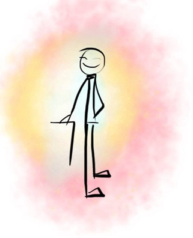

This is a TL;DR version of my previous post on "Is Yoga the sole source of my happiness?"
[wellness/posts/2018-02-source-of-happiness](/wellness/posts/2018-02-source-of-happiness)

I found this is a very interesting question I got asked recently (Enough that I really want to share it with everyone). What is it exactly that make me happy these days, are they different from what I thought back in my younger years? While my daily life hasn't changed much in the past five years, but somehow I feel like I've become a happier person than I've ever been.

---
##### Let's start from the very beginning, shall we?
---
As far as I remembered, I am always a happy, easy-going type of person. I was born as a healthy child, surrounded by well cared and loving family. My family is not rich but we definitely have enough of everything. I was doing quite well at school, went to a well known University, graduated, eventually landed myself my dream job which I still enjoy doing it until these days. 

---
##### Hey, your life sounds very successful! You should be happy, I can see nothing has to change.
---
All of these surely make me happy, many huge chunks of happiness really, I cannot deny that. However, I don't think I have enough self-awareness at the time and sometimes I experienced some unknown, unshakable pressure. These negativity feeling where I tried to keep up with all expectations from the society because I want them to award me with their validation, more success stories and social status.

At the time, I can tell I'm a strong believer of 'Work Hard, Play Hard' attitude, I pushed almost every single drop of my energy into work. Afterwards, if I have any stress I used money to buy new gadgets, to party, going out drinking hopefully to be relief and feel better on the next day. 

I kept working, pushing harder days and nights, doing overtime, rinse and repeat, keep improving myself so I can climb up the career ladder, aiming to be the best.

---
##### Nothing wrong with that! We're all work hard, play hard. Building social status and working towards one at the top?
---
Many times I have to admit, this attitude left me with a very bitter feeling and anxiety. I'm surrounded with friends, but the warmliness quickly disappeared when I'm alone and I don't feel like home. I feel lost from time to time, I don't know why I'm trying, what is my purpose in keep working hard? Is others still going to like me tomorrow? Do I even care about tomorrow at all? Who am I, and where is my identity, really?

I finally realized that my happiness here is entangled heavily on earning validation from others. I expected and relied on them too much, easily turning into depression. I should mentioned as well that while working long hours, I can only see myself at one single dimension, I don't exercise, I eat badly. While I'm still smiling, my health degraded. I feel negative and I kept them inside.

I don't think I can handle emotions very well...

---
##### Craving for shiny new things
---

I'd also fell into a trap of Materialism, I satisfied my cravings by spending money buying shiny new things, and I thought this is a happiness. As you might know already, it is not, and the good feeling I perceived does not last very long either. Actually it faded out very quickly, then you are back at square one again. This never ended. With more and more belongings, now I am worried, I have to find time and spaces for looking after all of those items.

Minimal living is a very interesting life style, and can be quite beneficial. I promise I will share what I've learnt from it, and how can I stop and break apart from the world of materialism later.

Anyway, I made a break-thru eventually. If you asked I've never thought at this point in life, my new interesting journey have just begun...

---
##### About five years ago, my life style has turned upside down. For the better!
---
From a person who spent most of the time inside a room, in front of my computer. Now I've adopted a very active way of living, and quickly become quite a energetic person.

I found myself went out running, losing half of my body weight, I have become pretty fit I can play better at any sports than I've ever done before in my life. 

I'm happy seeing myself improving physically. However, while I'm tougher outside, inside I still feel I'm under a lot of emotions and I don't know how to control them. I can achieve more with my body, but I also accidentally build a small unshakable ego, and I unintentionally put some unrealistic expectation on others without realizing.

Since the very beginning, I always feel more comfortable around machines, and I dont really like being around people so much. Now I'm very strong, I can achieve things on my own. I don't need to care so much about others anymore. I'm on my own now so let leave everything behind and never look back.

After that, I started going out hiking long distance. I always love mountain, I want adventure and I love being alone. Now I've finally become ready physically I can go as far as possible from the chaos of living with others, from my old self. 

More time I spend outside with natures I've experienced solitude, I experienced freedom. Probably for the first time ever in my life I found one practical way to reconnect my body back to my mind. I can go into the back of my head, seeing all my thoughts.

When I reached the top of the hill, out of no where. The relaxing atmosphere is indescribable, plenty of fresh air, smell of grass and the quietness. I can spread my personal space as far as I want it to be without any worries. I have found my happiness. 

Sounds like this is the end of my story. 
The only problem is when I got back home. 

I don't have quiet mind. My craving is back..I want more...  

Pretty much at this point I have found out a lot about myself, about feelings that I like, and my happiness that is well worth it. However, at the same time it's very hard to earn. I have to plan, go out running, walking for several hours, sometimes several days, in order to get my brain to release those mixture of happy doses. These brain drug chemical releasing moments we called 'Runner High' is damn great, but unfortunately our brain can be so forgetful. And the only way to have it more is to try even harder.

I've become an addict. I went out and pushing more and more intensively. The price I've paid is immense too as I've injured myself very often, so many times. I have injured my back, my knees, my feet, my neck etc. I went in and out Physiotherapy. I want to hit the limit, just for have a bit more of these doses of happiness.

I only know how to workout but I don't know how to rest. Even though I'm resting, my mind is not, apparently.

One day... I hurt myself so bad, too bad I cannot even move, and I'd to be bedridden for several days and I'm scared. This is when the fun stopped, and I really, have to stop.

I don't want to injure myself anymore.

During recovery time, my sister had introduced me to something sounds pretty hippy called Yoga. Truly say, I was skeptical at first, but at the end, This probably is the greatest gift I've ever obtained in my entire life.

---
##### And here is the part of my story how I brought myself from the extreme back into balance
---
Technically speaking, Yoga is one of the oldest system of personal development in the world. This system of balancing the body, mind and spirit. Developed by people who understood man's essential nature and realized the way to utilise our inner resources to live in harmony with himself and the environment.

What's amazing about Yoga is that it will teach you about yourself and how to love and be happy with it. It helped me reconnect deeply with my body in a mindful way. It can teach me and still allow me to push my body and mind to the limit, but also provide me the way to relax and come back to normal, while keeping that great sensation of achievement, like I had before without left myself injured. 

Yoga has taught me to accept my limitation, and help me being mindful about others. It helped me regain the sight to appreciate the beauty of uniqueness in every types and state of human bodies. The beauty that proved everyone is great in their own way, and we can helping each others by sharing our differences.  

By practicing Yoga it surely can bring happiness. However, it probably won't reward you with a huge chunk of happiness like buying a new car, or a rush to your brain like running an ultra marathon.

In my opinion, Yoga itself isn't my main source of happiness either, actually if you practice Yoga like Sports while ignoring practicing Mindfulness. Yoga will harm you badly with injuries, and even causes depression. However, doing it correctly, I've seen myself has been developed into a better person as it helped me to be able to find balance in my life. I have a healthier mind and body, which leaded to my new foundation of happiness, which is created from within myself.

Now, I've gained a realization that I'm able to tap into a pool of happiness that stored in the back of my brain. 
This is like unlocking into my saving account that I've been collecting for all my life, without ever realizing its existence.

Thinking about it again, those happiness has already been here with me, all the time. Unfortunately, as my forgetful brain cannot see it as a whole but most of the time, this looks like a mixing piles of many emotions I have experienced altogether instead. Now, I've learnt to pick out the positivity and be able to negotiate with my negativity, which I could handle with confident or sometimes just simply neglect, and leave it behind. 

Outside in, It also helped me to realize and appreciate those little happiness from surrounding that is happening all around me. Now, I can see, I can sense those little happiness from everywhere, all the time. 

I've learnt to love and enjoy life, I'm grateful for the time, for the day, for the weather. I'm grateful for my work, for food, for warm cloths, and I'm grateful that I have everyone and everything, that helping me living my life. 

Yoga's taught me to be honest to myself, to be more open minded. It's reconnected my body with the nature I love. I've learnt the way to be one with our Mother Earth.

It also helped reconnecting my mind back to society, to other human being. I have learnt a better way to communicate, not only with my inner self but also with others.

I've developed where my mind can be completely quiet through chaos. It let me be an observer of situation, while kept being unbiased and emotionally stable. 

I found that now I don't have to fear of any social judgement. I'm free from any unnecessary validation I used to hung up to.

Yoga's also showed me and opened the way to other mindfulness practices. Through this, I've become a keen practitioner of different several kinds of Meditation. 
Now, this helped taking me away from the need of Materialism, and helped me adopting more Minimalistic life style. 

I can feel that I've become more self-sustain. I've become more capable to take care of my mind and body. I've become more confident and ready to carry myself through any chaos in life that might happen (and it'll pass). Moreover, I'm more than ready to contribute back and become more useful to our community, our beautiful and chaotic society. 

And one last thing worth mentioning, and this is the best. Now, I knew that I'd never feel alone again, because, nowadays I've become my Best Friend, of myself.

All of these together is what make me a happy person, like I've never been before.

