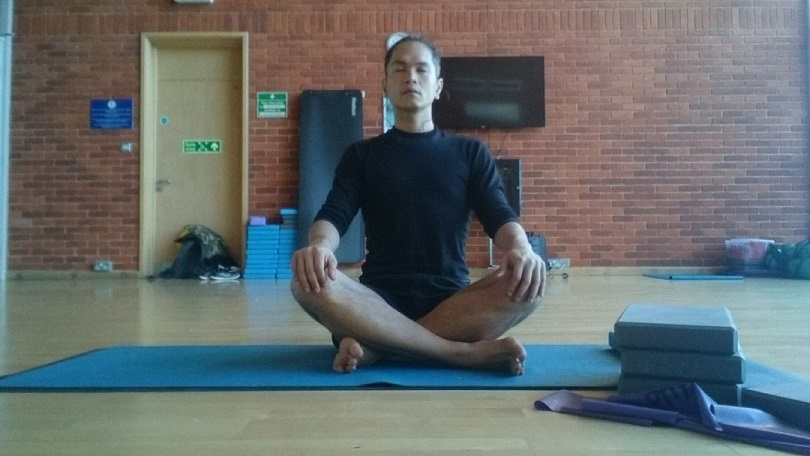

"Is Yoga the sole source of my happiness?" This is a very interesting question I got asked recently. What is it exactly that make me happy, are they different from what I thought back in my younger years? While my daily life hasn't changed much in the past five years, but somehow I feel like I've become a happier person than I've ever been.

---
For TL;DR version, check the following link 
[wellness/posts/2018-02-source-of-happiness-tldr](/wellness/posts/2018-02-source-of-happiness-tldr)

---

In my humble opinion, Yoga itself isn't the source of happiness, actually if you practice Yoga like Sports while ignoring practicing Mindfulness. Yoga will harm you with injuries, and even causes depression. However, doing it correctly, I've seen myself has been developed into a better person as it helped me to be able to find balance in my life. I have a healthier mind and body, which leaded to my new foundation of happiness, which is created from within myself. 

Outside in, It also helped me to realize and appreciate those little happiness that happening all around me.

Yoga's taught me to be honest to myself, to be more open minded. It's reconnected my body with the nature I love, with our Mother Earth. Not only that, it's also reconnected my mind back to our society, to other human being. It helped me see through Chaos, observing the Beauty of everything, while kept being emotionally Stable. 

Yoga also showed me the way to other mindfulness practices. Through this, I've become a keen practitioner of different several kinds of Meditation. It took me away from the need of Materialism, and helped me adopting more Minimalistic life style. 

I can feel that I've become more self-sustain. I've become more capable to take care of my mind and body. I've become more confident and ready to carry myself through any chaos in life that might happen (and it'll pass). Moreover, I'm more than ready to contribute back and become more useful to our community, our beautiful and chaotic society.

And one last thing worth mentioning, and this is the best. 
Now, I knew that I'd never feel alone again, because, nowadays I've become my Best Friend, of myself.

And all of these together is what make me a happy person, like I've never been before.

